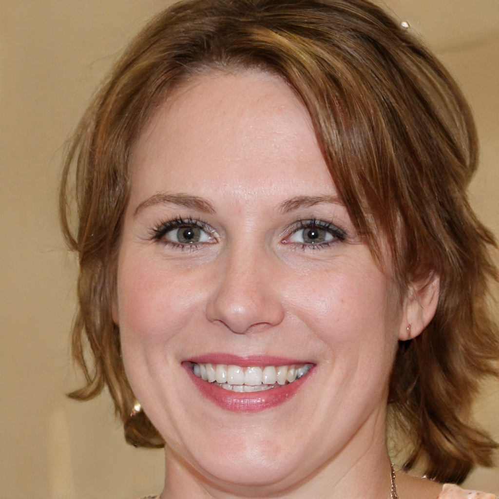
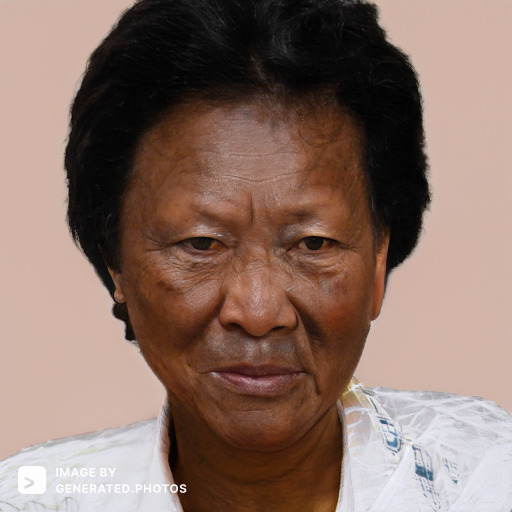

# Personas

Having a spectrum of personas is important when it comes to User Experience Engineering. A spectrum is important as it allows us to have an open mind and consider many use cases for our decentralised app (Dapp). In this case, a Dapp is a new concept to a lot of people. Individuals may not know anything about Dapps, Web3, Blockchain, Cryptocurrency or NFTs. Therefore, it is important to better understand all types of people who exist across a spectrum.

All images of people have been AI generated and are not real people.

## Che Daniels

<figure>
 
<figcaption align="left"><i>Source: https://generated.photos/face/neutral-black-young-adult-male-with-short-black-hair-and-brown-eyes--5e687c8f6d3b380006ef499b</i></figcaption>
</figure>

Che Daniels is a 23-year-old Chartered Accountant (CA), living in a flat in Wellington. He lives with two other people both are of the same age as Che. Che is kind hearted and has an interest in volunteering. Protecting digital assets is not something Che has considered before but has started to become more prevalent through his volunteering. Che's intentions are to help a community digitise their assets whilst not giving ownership to another community or organisation.  
**Activities:** Che dedicates a lot of his time to his clients, even working overtime at the office. Che is also does volunteering at Zelandia twice a week. He also loves socialising and loves doing movie nights with his flatmates.  
**Attitudes:** Che is an optimistic person. He always looks for the good in things and cherishes highly.  
**Aptitudes:** Che is a confident speaker, which makes him very useful at social events.  
**Weaknesses:** Che is very emotional and often takes things personally.  
**Domain Knowledge:** Che has no experience with decentralised apps.  
**System Knowledge:** Although Che is very comfortable with technology, he is unfamiliar with how decentralised apps work.  
**Interaction:** Che want to help the community he volunteers at with digitising their assets in a way that they would have ownership over their assets. So Che would interact with the DAFORST Dapp at his volunteering.  
**Priorities:** Che wants to do the right things and that would include help digitise and protect a community's assets.  
**Motivations:** Che has no background motivation to digitise assets, but is encourage by people still owning what they have but sharing it with others.  
**Computer self-efficacy:** Having grown up in a digital age, Che has very little trouble with technology. If something goes wrong, he will often Google the solution.  
**Risk tolerance:** Che is not an out and out risk taker in physical environments, but loves to explore and try new app and technologies.  
**Information Processing:** Che is a very good reader and will often soak in information quickly after reading passages or excerpts.  
**Tinkering:** Che loves his routines and processes but will leave them if he wants to do/try something new.  

## Karen Mount

<figure>
 
<figcaption align="left"><i>Source: https://this-person-does-not-exist.com/en</i></figcaption>
</figure>

Karen is a 55-year-old Research Librarian, living in Christchurch. She currently works at Christchurch City Libraries. She lives with her husband and two daughters, in the suburbs. Karen’s primary use of decentralised app is to learn and for research. She enjoys sharing her learnings from different books with her colleagues. She has interest to learn and grow more in this area, as it helps with her job.  

**Activities:** Linda spends most of her spare time looking after her family. She loves to attend a book club with her friends and shopping on the weekends with her daughters. 
**Attitudes:** Karen is a little naïve and self-centred. She often blames her mistakes on others, which leads to her leaving people on a sour note. She is a highly stressed individual. 
**Aptitudes:** Karen is very meticulous and is excellent with literature.  
**Weaknesses:** She is not very communicative and is a little self-centered. 
**Domain Knowledge:** Karen to is new to world of Dapps but has a foundation from reading books. So she has a basic understanding of where her data is going. 
**System Knowledge:** Karen has got some cryptocurrency and has downloaded a couple of Dapps. So she has experience in Dapps. She would not have a problem with using DAFORST, as it would be similar to other Dapps. 
**Interaction:** Karen often helps various communities through her work and using DAFORST would become an important part of her daily life. 
**Priorities:** As she helps communities through work, her learning to use DAFORST would help her share this knowledge with other communities so they could digitise their assets. 
**Motivations:** Karen has is very excited to learn more about Dapps as they will help when it comes to her work. 
**Computer self-efficacy:** Karen often is nervous initially when using technology. She has had a lot of exposure to different systems and often overcomes nervousness to learn technology. She will usually ask someone to help if she needs. 
**Risk tolerance:** Karen does not like risk and wants to be certain when uses technology, so she wants to know about what she uses. She would want to know how DAFORST stores the data they have access to and how they protect it. 
**Information Processing:** Karen finds literature easier to digest and she loses interest very quickly if something does not appeal to her. 
**Tinkering:** Karen has not got time to be messing around and is a creature of habit, so User Experience would be important for Karen when using DAFORST. 

## Amiri Ioane

<figure>
 
<figcaption align="left"><i>Source: https://generated.photos/face-generator/6281c291c26d75000c58ba62</i></figcaption>
</figure>

Amiri is a 68 year old Maori lady, living in Levin. She is currently retired with her 73 year old husband. Growing up Amiri's first language was Te Reo Maori. Before retirement Amiri was a daycare supervisor and often taught Te Reo to the ones she looked after. Now retired, Amiri enjoys gardening and has a love for flowers. She is not the least bit interested in technology. She has not personal interest in using DAFORST, but would need to use it with her gardening club. 
**Activities:** Amiri enjoys visiting the gardens of towns she travels to and enjoys the occassional visit to Te Papa in Wellington. She is also involved in a gardening club with her friends. 
**Attitudes:** Amiri is very relaxed. However, she is very stuck in her ways and is often found complaining about small things. 
**Aptitudes:** Amiri did not attend university and left school at 16. Her knowledge with technology is very limited. She needs very clear instruction with what to do and has a small attention span.  
**Weaknesses:** Amiri is not academically strong and finds complex topics very stressful. 
**Domain Knowledge:** Amiri has never heard of a decentralised app. 
**System Knowledge:** She struggles with centralised apps and often needs help from her husband. So making the Dapp simple to use would be very important 
**Interaction:** Amiri will use DAFORST with her gardening club, to digitise their plants (assets), but would be overwhelmed with technology. 
**Priorities:** Amiri's priorities are her husband and her gardening club, which often consumes her thoughts. She would disregard any domain knowledge shared with her and would likely need to repeat things if she had concerns. 
**Motivations:** Amiri's Gardening Club want to use DAFORST as they want to share their passion of flowers, but fear the internet and everything that it brings with it. 
**Computer self-efficacy:** Amiri uses her phone very seldomly but knows how to use basic social media platforms to communicate with her friends and family. 
**Risk tolerance:** Amiri used to be a fan of risks, in her heyday, but due to her old age she is more reserved now, when it comes to most things. 
**Information Processing:** Amiri does not take in information very quickly and oftens needs someones help to go over things until she is confident. 
**Tinkering:** Amiri is not a big tinkerer. She will often do something or leave it in its entirity. 